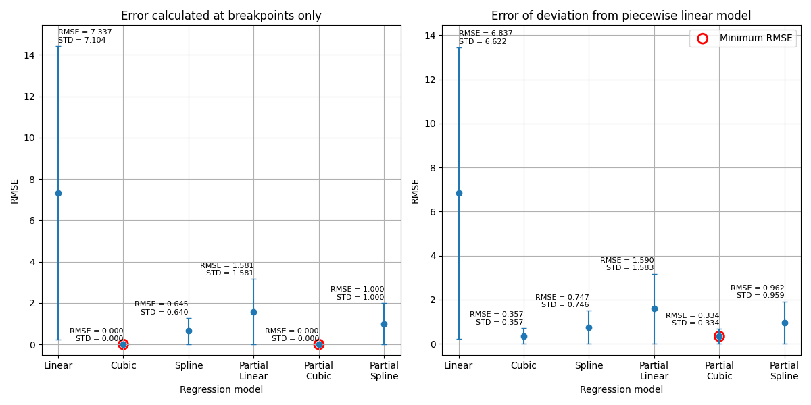

# inverse GSDF

In order to invert GSDF image to original Dicom image, GSDF's transfer function have been regressed through various method: Linear regression, and Non-linear regresstions such as Cubic, and Spline.

- [How to run](#how-to-run)
- [Description](#description)

## How to run
1. [Install python 3.9 or later, then assure its version via below command line](https://www.python.org/downloads/)
```bash
python -V
```
2. Install dependencies, type below command at the directory, where "requirements.txt" file is located
```bash
pip install -r requirements.txt
```
3. Run "RunThis_for_evaluate.py" to evaluate various regression methods:
```bash
python RunThis_for_evaluate.py
```
3. Run "RunThis_for_conduct_inverse_GSDF.py" to conduct inverting GSDF and dump its resultants:
```bash
python RunThis_for_conduct_inverse_GSDF.py
```

## Description
In this case, 'partial cubic regression' is the best way for estimating inverse GSDF transfer function.

TBD in details ...
